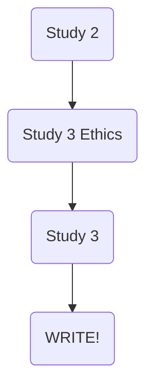
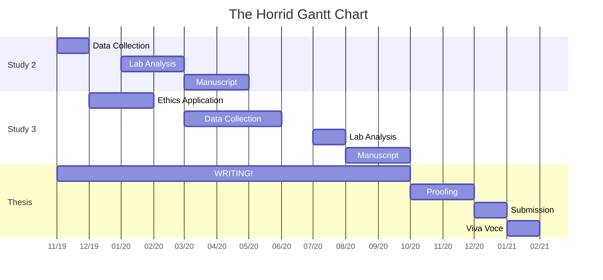

I'm rather a big fan of the show 'Gilmore Girls'! In season  7 episode 12, Paris prepares what can only be described as the most magnificent timetable in the lead up to finals. Being in the final year of my PhD, it seemed fitting to put together my own #OperationFinishLine; although, this is liekly to be subpar when compared to Paris's operation. I started my PhD in 2017 and am due to finish at the end of 2020. Like many PhD programmes, mine has had it's fair share of problems. Nonetheless, I am in the end-game and hopefully this serves as a form of motivation to stay on target.

Below is a general overview of what I have left to do... a lot I know. 

While I have this general map in mind, if I want to channel my inner Paris Geller I need a more structured plan; cue the Gantt chart. I've tried to breakdown the major remainding tasks of my PhD into more digestable ones with a given time period. This was also a good opportunity to play around with the `DiagrammeR` package in R. I am currently in the midst of data collection for my second study and therefore the Gantt chart takes off from there. Over the Christmas period I plan to draft up my final PhD research study and complete the associated ethical application. This way I can hit the ground running come January. Following approval from the University's research ethics committee, I will begin data collection. I've given myself a rather conservetive deadline for the final study and hope to have this wrapped up by June 2020. The remainder of my time will largely be dedicated to data analysis and **WRITING MY THESIS!** Currently I have some parts of my thesis written but certainly have the majority ahead of me; a joyice time. I'm not sure This is operation finish line! I still need to put some more thought into a writing plan but perhaps I will update this once I have a clearer idea.

