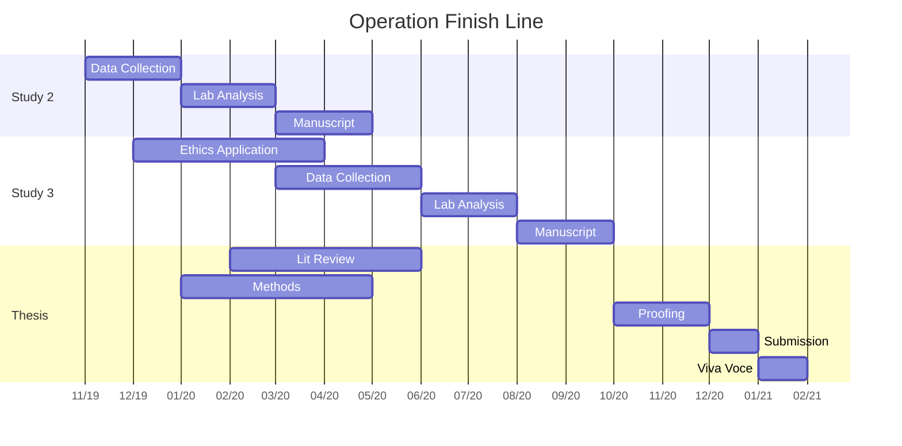

I'm rather a big fan of the show **Gilmore Girls**! With that being said, I distinctly remember an episode where Paris Geller unveils the most meticulous timetable I've ever seen! Paris goes on to explain that this is "operation finish line", where she has taken the liberty of planning every moment of time before finals. While a PhD is a little different to finals; being in my final year, it seemed fitting to initialise my own _operation finish line_. Although, this is likely to be sub-par when compared to Paris's operation. I started my PhD in 2017 and am due to finish at the end of 2020... fingers crossed. Like many PhD programmes, mine has had its fair share of problems. Nonetheless, I am in the end-game and hope this serves as both a form of procrastination, but mostly, motivation.



Although I have a general plan in mind, if I want to go full Paris I need a more structured plan; cue the Gantt chart. I've tried to breakdown the major remaining tasks of my PhD into more digestible objectives with a given time period. _n.b._ This was also a good opportunity to play around with the `DiagrammeR` package in R.

I recently submitted my final ethical application for my **last** PhD study. The application has just been reviewed by the University's research ethics committee and should be back with me in the coming week. Following ethical approval, I will begin the last of my data collection. I have been quite optimistic with my data collection time allocation and hope to have it wrapped up by June 2020. The study requires participants to attend the laboratory on three separate occasions separated by one week each, so it is going to be difficult.

The remainder of my time will largely be dedicated to analysis and **WRITING MY THESIS!** Currently, I have some parts of my thesis written, but certainly have the majority ahead of me; a joyous time. I have scheduled some writing deadlines but much of this depends on getting both my outstanding laboratory analysis complete - which I currently have insufficient funds for - and statistical analysis, which are proving more difficult than I anticipated. Anyone who has written a thesis will know writing comes in waves. This is my feeble attempt at operation finish line; wish me luck!

